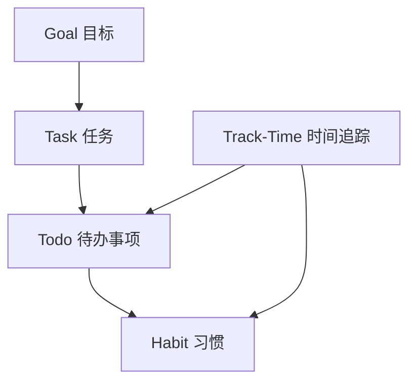

# 成长模块测试

## 概述

成长模块提供个人成长和效率管理功能的测试，包括习惯管理、待办事项、任务管理、目标设定和时间追踪等功能。

## 模块结构

```
test/business/growth/
├── README.md                    # 成长模块测试总文档
├── habit/                       # 习惯管理模块 ✅
│   ├── unit/                    # 单元测试
│   ├── integration/             # 集成测试
│   ├── utils/                   # 测试工具
│   └── README.md               # 习惯模块测试文档
├── todo/                        # 待办事项模块 (待开发)
│   ├── unit/                    # 单元测试
│   ├── integration/             # 集成测试
│   ├── utils/                   # 测试工具
│   └── README.md               # 待办模块测试文档
├── task/                        # 任务管理模块 (待开发)
│   ├── unit/                    # 单元测试
│   ├── integration/             # 集成测试
│   ├── utils/                   # 测试工具
│   └── README.md               # 任务模块测试文档
├── goal/                        # 目标管理模块 (待开发)
│   ├── unit/                    # 单元测试
│   ├── integration/             # 集成测试
│   ├── utils/                   # 测试工具
│   └── README.md               # 目标模块测试文档
└── track-time/                  # 时间追踪模块 (待开发)
    ├── unit/                    # 单元测试
    ├── integration/             # 集成测试
    ├── utils/                   # 测试工具
    └── README.md               # 时间追踪模块测试文档
```

## 模块测试状态

| 模块 | 功能描述 | 测试状态 | 测试覆盖率 | 优先级 |
|------|----------|----------|------------|--------|
| 🎯 **Habit** | 习惯管理 | ✅ 完成 | 完整 | 已完成 |
| 📝 **Todo** | 待办事项管理 | 📋 计划中 | 0% | 高 |
| 📋 **Task** | 任务管理 | 📋 计划中 | 0% | 高 |
| 🎯 **Goal** | 目标设定与追踪 | 📋 计划中 | 0% | 中 |
| ⏱️ **Track-Time** | 时间追踪 | 📋 计划中 | 0% | 低 |

## 功能概览

### ✅ 习惯管理 (Habit)
- **状态**: 测试完成
- **功能**: 习惯创建、追踪、统计分析
- **测试覆盖**: 单元测试 + 集成测试
- **文档**: [习惯模块测试文档](./habit/README.md)

### 📋 待办事项 (Todo)
- **状态**: 待开发测试
- **功能**: 待办事项CRUD、状态管理、重复任务
- **主要服务**: TodoService, TodoBaseService, TodoStatusService, TodoRepeatService
- **测试计划**: 基础CRUD + 状态流转 + 重复逻辑

### 📋 任务管理 (Task)
- **状态**: 待开发测试
- **功能**: 任务管理、任务树结构、状态追踪
- **主要服务**: TaskService, TaskTreeService, TaskStatusService
- **测试计划**: 任务CRUD + 树形结构 + 状态管理

### 🎯 目标管理 (Goal)
- **状态**: 待开发测试
- **功能**: 目标设定、目标树结构、进度追踪
- **主要服务**: GoalService, GoalTreeService, GoalStatusService
- **测试计划**: 目标CRUD + 树形结构 + 进度计算

### ⏱️ 时间追踪 (Track-Time)
- **状态**: 待开发测试
- **功能**: 时间记录、统计分析
- **主要组件**: Entity, DTO, Mapper
- **测试计划**: 基础数据处理 + 时间统计

## 开发优先级

### 高优先级 (本月)
1. **Todo模块测试** - 待办事项是核心功能
2. **Task模块测试** - 任务管理与Todo密切相关

### 中优先级 (下月)
3. **Goal模块测试** - 目标管理是重要的成长功能

### 低优先级 (后续)
4. **Track-Time模块测试** - 时间追踪功能相对独立

## 模块间关系



### 依赖关系说明
- **Goal → Task**: 目标可以分解为多个任务
- **Task → Todo**: 任务可以分解为具体的待办事项
- **Todo → Habit**: 重复的待办事项可以转化为习惯
- **Track-Time**: 可以追踪任何活动的时间消耗

## 测试策略

### 单元测试重点
1. **服务层逻辑**: 各模块的业务逻辑测试
2. **数据处理**: DTO转换、数据验证
3. **状态管理**: 状态流转逻辑
4. **树形结构**: 层级关系处理

### 集成测试重点
1. **模块间交互**: 目标→任务→待办的数据流
2. **API端点**: 控制器层完整测试
3. **数据库操作**: 实际数据库交互测试

### 端到端测试重点
1. **完整工作流**: 从目标设定到任务完成的完整流程
2. **用户场景**: 真实用户使用场景模拟

## 运行测试

```bash
# 运行成长模块所有测试
npm test -- test/business/growth

# 运行特定子模块测试
npm test -- test/business/growth/habit
npm test -- test/business/growth/todo
npm test -- test/business/growth/task
npm test -- test/business/growth/goal
npm test -- test/business/growth/track-time

# 生成覆盖率报告
npm test -- test/business/growth --coverage
```

## 下一步计划

### 第1周: Todo模块测试
- [ ] 创建TodoTestFactory
- [ ] 实现TodoService单元测试
- [ ] 实现TodoController测试
- [ ] 添加状态管理和重复逻辑测试

### 第2周: Task模块测试
- [ ] 创建TaskTestFactory
- [ ] 实现TaskService单元测试
- [ ] 实现TaskTreeService测试
- [ ] 添加任务层级关系测试

### 第3周: Goal模块测试
- [ ] 创建GoalTestFactory
- [ ] 实现GoalService单元测试
- [ ] 实现目标进度计算测试
- [ ] 添加目标树结构测试

### 第4周: Track-Time模块测试
- [ ] 创建TrackTimeTestFactory
- [ ] 实现基础数据处理测试
- [ ] 添加时间统计功能测试

## 注意事项

1. **数据一致性**: 确保模块间数据关系的一致性
2. **状态同步**: 测试状态变更时的数据同步
3. **性能考虑**: 树形结构查询的性能测试
4. **边界情况**: 深层嵌套、循环依赖等边界情况
5. **用户体验**: 复杂操作的用户友好性测试

---

*最后更新时间: 2024年12月* 