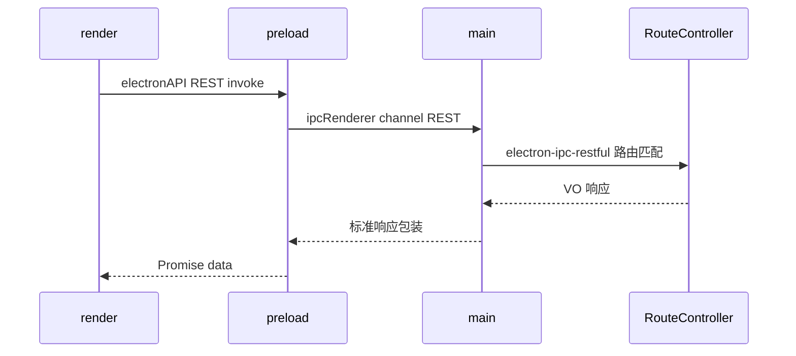

# Desktop 进程与目录分层

## 进程模型



| 目录 | 运行环境 | 职责 |
| --- | --- | --- |
| `src/main` | Node（主进程） | 创建窗口、`initIpcRouter` 注册 route-controller；`pnpm dev` 下还有 REST / TypeORM Lab 钩子 |
| `src/preload` | 隔离上下文 | 向 `window.electronAPI` 暴露 REST 风格 API |
| `src/render` | Chromium | React UI、路由、模块 Context |
| `src/dev` | Chromium（仅 DEV） | `DevDockAttach` 挂 `@ylib/product-dock`；`pnpm dev` 注册 Lab，`pnpm dev:product` 注册讲解面板 |
| `src/service` | Node（主进程侧） | TypeORM、业务 Service、**RouteController（IPC 入口）** |

## render 层约定

- 页面：`render/pages/{domain}/`，Growth 在 `render/pages/growth/`
- 路由：`render/router/`
- 模块状态：使用 `createInjectState`（`render/utils/createInjectState.tsx`），每功能块独立 Provider + hook
- 样式：CSS Modules（`*.module.less`）+ Tailwind，与 `@sue/design-web-react`（前缀 `sue`）配合。按单元素视觉声明条数分流：≤3 优先 Tailwind；3–5 有定制或较长用 Modules，否则 Tailwind；>5 用 Modules。计数不含 `Flex` / `Row` / `Col` 布局 props。页面壳层优先使用 `Flex`（`container="full|fixed|fill"`）。`fixed` 不自动撑满交叉轴：列父加 `w-full`，行父加 `h-full`（对齐已移除的 `FlexibleContainer.Fixed`）。UI 落地细则见项目 skill「框架规范 · React UI规范」
- UI 组件：布局/表单/反馈直接用 `@sue/design-web-react` 公开 API；图标优先 design-web 的 `*Outlined`/`*Filled`，缺省再用 `@ant-design/icons`。禁止再引入 Arco 风格 compat（已移除的 `Typography`/`Icon*`/`Grid`/`Result`/`Steps`/`List` 等 shim）。业务一等能力（`SiteIcon`、`RepeatSelector`、`ContextMenu`）放在 `@/components`；HTTP 错误提示直接用 design-web 的 `message`
- 数据调用：优先 `@true-north/web-service`（Service + Controller + request）→ preload REST
- Electron 桥类型：`@true-north/web-service/electron-types`（preload `import type`；render side-effect import 激活 `Window.electronAPI`）

示例（Context 形态）：

```typescript
export const [GoalDetailProvider, useGoalDetailContext] = createInjectState<{
  PropsType: { children: React.ReactNode };
  ContextType: {
    loading: boolean;
    // ...
  };
}>(() => {
  // 状态与请求编排
});
```

## service 层约定

- 数据库：`service/db/`（`AppDataSource`、SQLite）
- 装饰器：`@business/decorators`（桥接 `electron-ipc-restful`，并保留 description 等元数据）
- **单个模块 IPC/VO 入口**：`*.route-controller.ts`（不再另设 `*.controller.ts` 透传层）
- 注册：`src/main/ipc-handlers.ts` 将各模块 RouteController **Class** 交给 `registerIpcHandlers`（构造器默认注入模块 service 单例）

## 前端页面模块（Growth）

```
render/pages/
├── growth/
│   ├── goal/
│   ├── task/
│   ├── todo/
│   ├── habit/
│   └── components/     # 跨模块详情、列表等
├── expense/
├── dashboard/
├── timer/
└── ...
```

业务规则与模块产品说明见 [ProductWiki · Growth](../../../packages/product-wiki/wiki/growth/spec.json)。

## DEV 主窗口分栏

两条启动脚本通过 `TN_DEV_PROFILE` 分流，互不加载对方的面板：

| 脚本 | profile | DevTools | dock |
| --- | --- | --- | --- |
| `pnpm dev` | `lab`（默认） | 首次加载后 `openDevTools()` | 加载 Lab，默认关闭；View 菜单只有 **Lab** |
| `pnpm dev:product` | `product` | 不自动打开 | 加载讲解面板并默认打开；View 菜单只有 **ProductWiki** |

**Toggle Developer Tools** 走 Electron 默认 `webContents.toggleDevTools()`，与 dock 无关。

- 右栏是一个 `@ylib/product-dock`：竖向 tab 为当前 profile 注册的面板。渲染进程 `DevDockAttach` 自己 `installHostDock()` 再 `register`
- ProductWiki（仅 `dev:product`）：Vite 插件启动讲解服务；iframe 指向 `window.__productWikiService.viewsUrl`；`attachProductWiki({ router, onSetVisible })` 只负责 inspect，关面板走 `dock.setVisible`
- Lab（仅 `pnpm dev`）：iframe 加载 `@true-north/dev-lab` 的 `labPageRoute`（`Lab.html` + `Lab.tsx`，只 `bootstrapLabPanel()`）。preload 仅 lab profile 暴露 `labPanel` IPC 桥；iframe 经 `postMessage` 与宿主 `bindLabFrame` 通信
- DevTools：对 app `webContents` 调用 `openDevTools()` / `toggleDevTools()`，不托管分栏、不改 `appView` bounds
- 主进程用 `wikiDockPreferred` / `labDockPreferred` 同步菜单与 `window.__devDock` 的 tab / 显隐，不把 Lab 装进独立 `labView`
- 生产构建不挂 dock、不包装 REST、不采集 SQL / spawn / MCP

Lab 当前第一个工具是**请求时间线**：一条 IPC 一行，展开可看 params、response、duration 以及子 span（sql / spawn / mcp）。并行的 `/task/list` 各占一行并用 `AsyncLocalStorage` 把 SQL 挂到对应 IPC。AI 的 `startMessageStream` 会在 handler 返回后继续跑 Codex/MCP，后续 span 通过已有 `streamId` 挂回同一行。

采集器在 `@true-north/dev-lab`（`packages/dev-lab`）：约 200 条环形缓冲，敏感字段按 `password|apiKey|authorization|secret|token` 脱敏。desktop 只留宿主适配：

- REST：`src/main/dev-trace/ipc-hook.ts` 在 `initIpcRouter()` 里、`registerIpcHandlers` 之前包装 `ipcMain.handle('REST')`（`electron-ipc-restful` 无拦截器 API）
- TypeORM：`src/main/dev-trace/sql-logger.ts` DEV 自定义 `Logger`（`logQuery` / `logQueryError`），忽略 schema/migration
- Codex `spawnCodex` 与 loopback MCP `tools/call`：一行 `traceExternal`（`@true-north/dev-lab/collector`），不把 prompt 打进时间线

## 相关文档

- [data-flow.md](./data-flow.md)
- [development/controller/controller-desktop.md](../development/controller/controller-desktop.md)
