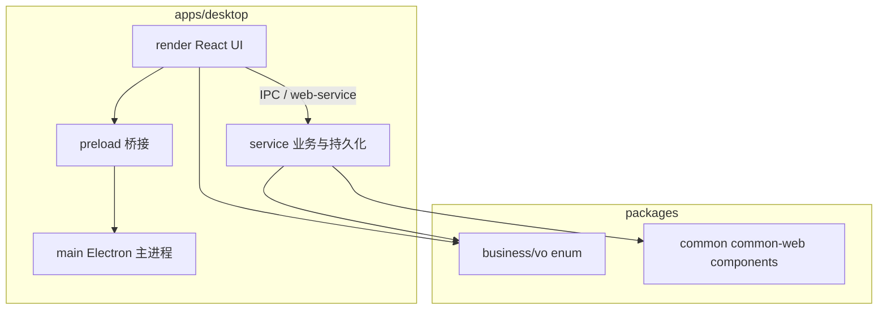

# 技术栈与分层总览

## 技术栈

```yaml
tech_stack:
  monorepo: 'pnpm workspace + Turbo'
  desktop:
    runtime: 'Electron'
    build: 'electron-vite'
    package: 'electron-builder'
  renderer:
    framework: 'React 18 + TypeScript'
    build: 'Vite'
    ui: ['@sue/design-web-react']
    router: 'React Router v6'
    styles: 'CSS Modules + Less + TailwindCSS'
  service_layer:
    orm: 'TypeORM'
    database: 'SQLite（本地）'
    validation: 'class-validator + class-transformer'
  shared:
    vo: '@true-north/vo'
    enum: '@true-north/enum'
    web_service: 'packages/business/web-service（含 controller）'
```

## 分层总览



| 层级 | 位置 | 职责 |
| --- | --- | --- |
| 渲染层 | `apps/desktop/src/render` | 页面、路由、Context 状态、调用 API |
| 服务层 | `apps/desktop/src/service` | Entity、DTO、Repository、Service、RouteController |
| 主进程 | `apps/desktop/src/main` | 窗口、生命周期、注册 IPC |
| 预加载 | `apps/desktop/src/preload` | 安全暴露 IPC 给渲染进程 |
| 共享包 | `packages/*` | VO、枚举、通用工具与 Web 组件 |

## 工具链

- 开发：`pnpm dev`（Lab + 默认开 DevTools）；产品讲解：`pnpm dev:product`
- 构建：`pnpm build`
- 质量：ESLint + Prettier + Husky
- 测试：Jest（按需）

## 相关文档

- [monorepo-layout.md](./monorepo-layout.md)
- [desktop-layers.md](./desktop-layers.md)
- [data-flow.md](./data-flow.md)
