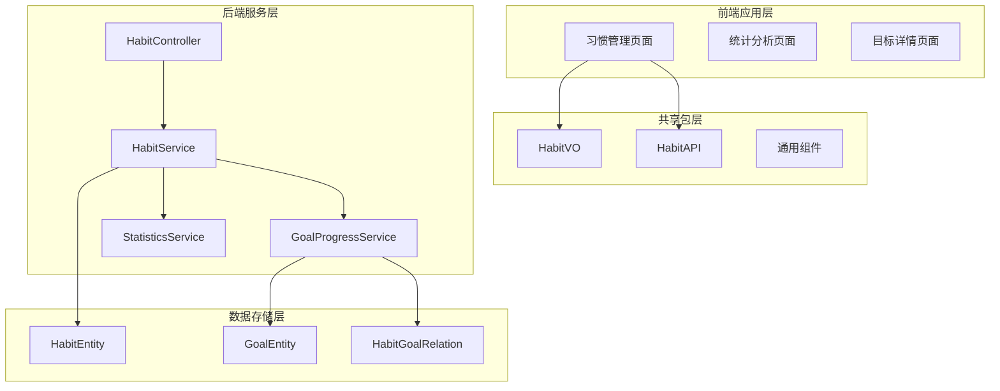

# 习惯管理模块 - 技术开发文档

## 📋 文档元信息

```yaml
document_meta:
  title: "习惯管理模块技术开发文档"
  version: "v1.0.0"
  status: "draft"
  created_date: "2024-01-01"
  last_updated: "2024-01-01"
  owner: "后端开发团队"
  reviewers: ["架构师", "前端负责人"]
  target_audience: ["backend_developer", "frontend_developer"]
  related_documents: ["doc/growth/habit/prd.md"]

tech_stack:
  backend:
    framework: "NestJS"
    language: "TypeScript"
    database: "MySQL/SQLite"
    orm: "TypeORM"
    auth: "JWT + bcrypt"
  frontend:
    framework: "React 18"
    language: "TypeScript"
    build_tool: "Vite"
    ui_library: ["Arco Design", "Ant Design"]
    state_management: "Redux + Nanostores"
  shared:
    package_manager: "pnpm"
    monorepo_tool: "Turbo"
    code_quality: ["ESLint", "Prettier", "Husky"]
```

## 🏗️ 系统架构设计

### 架构概览

```typescript
interface HabitSystemArchitecture {
  overview: {
    purpose: "目标驱动的习惯管理系统，建立目标与习惯的强关联关系";
    scope: ["习惯CRUD", "目标关联", "进度追踪", "统计分析", "待办集成"];
    constraints: ["强制目标关联", "实时进度同步", "数据一致性保障"];
    principles: ["目标导向", "数据驱动", "用户体验优先", "可扩展性"];
  };

  layers: {
    presentation: {
      components: ["HabitPage", "HabitForm", "HabitCard", "StatisticsChart"];
      responsibilities: ["用户交互", "数据展示", "状态管理", "路由控制"];
      technologies: ["React", "Arco Design", "Redux", "React Router"];
    };
    business: {
      modules: ["HabitModule", "GoalModule", "TodoModule"];
      services: ["HabitService", "GoalProgressService", "StatisticsService"];
      patterns: ["Repository Pattern", "Service Layer", "Event Driven"];
    };
    data: {
      entities: ["HabitEntity", "GoalEntity", "HabitGoalRelationEntity"];
      repositories: ["HabitRepository", "GoalRepository"];
      storage: ["MySQL", "SQLite", "Redis Cache"];
    };
  };

  dependencies: {
    HabitModule: {
      depends_on: ["GoalModule", "TodoModule", "UserModule"];
      used_by: ["StatisticsModule", "AIModule"];
      interfaces: ["IHabitService", "IGoalProgressService"];
    };
  };
}
```

### 架构图



## 📊 数据模型设计

### 核心实体定义

```typescript
// 导入依赖
import {
  Entity,
  Column,
  OneToMany,
  ManyToOne,
  JoinColumn,
  Index,
} from "typeorm";
import {
  IsString,
  IsOptional,
  IsEnum,
  IsArray,
  IsNumber,
  IsBoolean,
  IsInt,
  Min,
  Max,
  Length,
  IsISO8601,
} from "class-validator";
import { Type } from "class-transformer";
import { BaseEntity } from "@/base/base.entity";

// 习惯状态枚举
export enum HabitStatus {
  ACTIVE = "active",
  PAUSED = "paused",
  COMPLETED = "completed",
  ABANDONED = "abandoned",
}

// 习惯实体
@Entity("habits")
export class HabitEntity extends BaseEntity {
  /** 习惯名称 - 必填, 1-50字符 */
  @Column()
  @IsString()
  @Length(1, 50)
  title: string;

  /** 描述 - 可选, 最多200字符 */
  @Column({ nullable: true })
  @IsString()
  @IsOptional()
  @Length(0, 200)
  description?: string;

  /** 重要程度 - 1-5级, 默认3 */
  @Column({ default: 3 })
  @IsNumber()
  @Type(() => Number)
  @IsInt()
  @Min(1)
  @Max(5)
  importance: number = 3;

  /** 难度等级 - 1-5级, 默认3 */
  @Column({ default: 3 })
  @IsNumber()
  @Type(() => Number)
  @IsInt()
  @Min(1)
  @Max(5)
  difficulty: number = 3;

  /** 标签 - JSON数组格式, 最多5个 */
  @Column("simple-array", { nullable: true })
  @IsArray()
  @IsString({ each: true })
  @IsOptional()
  tags?: string[];

  /** 开始日期 - 必填 */
  @Column("date")
  @IsISO8601()
  @Type(() => Date)
  startDate: Date;

  /** 目标日期 - 可选 */
  @Column("date", { nullable: true })
  @IsISO8601()
  @IsOptional()
  @Type(() => Date)
  targetDate?: Date;

  /** 状态 - 默认active */
  @Column({ type: "enum", enum: HabitStatus, default: HabitStatus.ACTIVE })
  @IsEnum(HabitStatus)
  status: HabitStatus = HabitStatus.ACTIVE;

  /** 完成次数 - 默认0 */
  @Column({ default: 0 })
  @IsNumber()
  @Type(() => Number)
  @IsInt()
  @Min(0)
  completedCount: number = 0;

  /** 当前连续天数 - 默认0 */
  @Column({ default: 0 })
  @IsNumber()
  @Type(() => Number)
  @IsInt()
  @Min(0)
  currentStreak: number = 0;

  /** 最长连续天数 - 默认0 */
  @Column({ default: 0 })
  @IsNumber()
  @Type(() => Number)
  @IsInt()
  @Min(0)
  longestStreak: number = 0;

  /** 用户ID - 外键关联 */
  @Column()
  @IsString()
  userId: string;

  // 关联关系
  @ManyToOne(() => UserEntity, (user) => user.habits)
  @JoinColumn({ name: "userId" })
  user: UserEntity;

  @OneToMany(() => HabitGoalRelationEntity, (relation) => relation.habit)
  goalRelations: HabitGoalRelationEntity[];

  @OneToMany(() => HabitCompletionEntity, (completion) => completion.habit)
  completionRecords: HabitCompletionEntity[];
}

// 习惯-目标关联实体
@Entity("habit_goal_relations")
@Index(["habitId", "goalId"], { unique: true })
export class HabitGoalRelationEntity extends BaseEntity {
  /** 习惯ID - 外键 */
  @Column()
  @IsString()
  habitId: string;

  /** 目标ID - 外键 */
  @Column()
  @IsString()
  goalId: string;

  /** 贡献权重 - 1-10级, 默认5 */
  @Column({ default: 5 })
  @IsNumber()
  @Type(() => Number)
  @IsInt()
  @Min(1)
  @Max(10)
  contributionWeight: number = 5;

  // 关联关系
  @ManyToOne(() => HabitEntity, (habit) => habit.goalRelations)
  @JoinColumn({ name: "habitId" })
  habit: HabitEntity;

  @ManyToOne(() => GoalEntity, (goal) => goal.habitRelations)
  @JoinColumn({ name: "goalId" })
  goal: GoalEntity;
}

// 习惯完成记录实体
@Entity("habit_completions")
@Index(["habitId", "completedDate"], { unique: true })
export class HabitCompletionEntity extends BaseEntity {
  /** 习惯ID - 外键 */
  @Column()
  @IsString()
  habitId: string;

  /** 完成日期 */
  @Column("date")
  @IsISO8601()
  @Type(() => Date)
  completedDate: Date;

  /** 备注 - 可选 */
  @Column({ nullable: true })
  @IsString()
  @IsOptional()
  @Length(0, 500)
  notes?: string;

  // 关联关系
  @ManyToOne(() => HabitEntity, (habit) => habit.completionRecords)
  @JoinColumn({ name: "habitId" })
  habit: HabitEntity;
}
```

### DTO传输对象定义

```typescript
// habit-model.dto.ts
import { BaseModelDto } from "@/base/base-model.dto";
import { OmitType, IntersectionType } from "@nestjs/mapped-types";
import { HabitEntity } from "../entities";

// 基础DTO - 包含所有字段
export class HabitDto extends IntersectionType(
  BaseModelDto,
  OmitType(HabitEntity, ["user", "goalRelations", "completionRecords"] as const)
) {
  // 关联字段
  user?: UserDto;
  goalRelations?: HabitGoalRelationDto[];
  completionRecords?: HabitCompletionDto[];
}

// 模型DTO - 排除关联字段
export class HabitModelDto extends OmitType(HabitDto, [
  "user",
  "goalRelations",
  "completionRecords",
] as const) {}

// habit-form.dto.ts
import { PartialType, PickType } from "@nestjs/mapped-types";
import {
  IsOptional,
  IsArray,
  IsString,
  IsNumber,
  IsInt,
  Min,
  Max,
} from "class-validator";
import { Type } from "class-transformer";
import { HabitDto } from "./habit-model.dto";

// 创建DTO
export class CreateHabitDto extends PickType(HabitDto, [
  "title",
  "description",
  "importance",
  "difficulty",
  "tags",
  "startDate",
  "targetDate",
  "userId",
] as const) {
  /** 关联目标ID列表 - 必填, 至少一个 */
  @IsArray()
  @IsString({ each: true })
  goalIds: string[];

  /** 对应目标的贡献权重数组 - 必填 */
  @IsArray()
  @IsNumber({}, { each: true })
  @Type(() => Number)
  @IsInt({ each: true })
  @Min(1, { each: true })
  @Max(10, { each: true })
  contributionWeights: number[];
}

// 更新DTO
export class UpdateHabitDto extends PartialType(
  PickType(CreateHabitDto, [
    "title",
    "description",
    "importance",
    "difficulty",
    "tags",
    "targetDate",
  ] as const)
) {
  /** 状态更新 - 可选 */
  @IsOptional()
  @IsEnum(HabitStatus)
  status?: HabitStatus;
}

// habit-filter.dto.ts
import {
  IsOptional,
  IsString,
  IsArray,
  IsEnum,
  IsNumber,
  IsInt,
} from "class-validator";
import { Type } from "class-transformer";
import { PageDto } from "@/base/page.dto";
import { HabitDto } from "./habit-model.dto";
import { HabitStatus } from "../entities";
import { PickType, IntersectionType, PartialType } from "@nestjs/mapped-types";

// 列表过滤DTO
export class HabitListFilterDto extends PartialType(
  PickType(HabitDto, ["status", "importance", "userId"] as const)
) {
  /** 搜索关键词 */
  @IsString()
  @IsOptional()
  keyword?: string;

  /** 日期范围过滤 */
  @IsString()
  @IsOptional()
  dateStart?: string;

  @IsString()
  @IsOptional()
  dateEnd?: string;

  /** 目标ID过滤 */
  @IsString()
  @IsOptional()
  goalId?: string;

  /** 排除自身 */
  @IsOptional()
  @Type(() => Boolean)
  withoutSelf?: boolean;

  /** 状态数组过滤 */
  @IsArray()
  @IsEnum(HabitStatus, { each: true })
  @IsOptional()
  statusList?: HabitStatus[];

  /** 标签过滤 */
  @IsArray()
  @IsString({ each: true })
  @IsOptional()
  tags?: string[];

  /** 排序字段 */
  @IsString()
  @IsOptional()
  sortBy?: "createdAt" | "importance" | "currentStreak";

  /** 排序方向 */
  @IsString()
  @IsOptional()
  sortOrder?: "ASC" | "DESC";
}

// 分页过滤DTO
export class HabitPageFilterDto extends IntersectionType(
  PageDto,
  HabitListFilterDto
) {}

// 标记完成DTO
export class MarkCompletionDto {
  /** 完成日期 - ISO格式 */
  @IsString()
  @IsISO8601()
  completedDate: string;

  /** 备注 - 可选 */
  @IsString()
  @IsOptional()
  @Length(0, 500)
  notes?: string;
}

// 目标关联DTO
export class HabitGoalRelationDto {
  /** 目标ID */
  @IsString()
  goalId: string;

  /** 贡献权重 - 1-10级 */
  @IsNumber()
  @Type(() => Number)
  @IsInt()
  @Min(1)
  @Max(10)
  contributionWeight: number;
}
```

### VO值对象定义

```typescript
// habit-model.vo.ts
import { BaseModelVo } from "../../base";

// 习惯状态枚举
export enum HabitStatus {
  ACTIVE = "active",
  PAUSED = "paused",
  COMPLETED = "completed",
  ABANDONED = "abandoned",
}

// 基础模型VO
export type HabitModelVo = {
  title: string;
  description?: string;
  importance: number;
  difficulty: number;
  tags?: string[];
  startDate: string;
  targetDate?: string;
  status: HabitStatus;
  completedCount: number;
  currentStreak: number;
  longestStreak: number;
  userId: string;
};

// 项目VO (包含基础字段)
export type HabitItemVo = BaseModelVo & HabitModelVo;

// 完整VO (包含关联数据和计算字段)
export type HabitVo = HabitItemVo & {
  // 关联数据
  goalRelations?: HabitGoalRelationVo[];
  user?: UserItemVo;

  // 计算字段
  completionRate: number; // 完成率
  totalDays: number; // 总天数
  todayCompleted: boolean; // 今日是否完成
  isOverdue: boolean; // 是否过期
  remainingDays?: number; // 剩余天数
  goalCount: number; // 关联目标数量
};

// habit-filter.vo.ts
import { HabitVo, HabitItemVo, HabitStatus } from "./habit-model.vo";

// 列表过滤VO
export type HabitListFiltersVo = Partial<
  Pick<HabitVo, "status" | "importance" | "userId"> & {
    keyword?: string;
    dateStart?: string;
    dateEnd?: string;
    goalId?: string;
    withoutSelf?: boolean;
    statusList?: HabitStatus[];
    tags?: string[];
    sortBy?: "createdAt" | "importance" | "currentStreak";
    sortOrder?: "ASC" | "DESC";
  }
>;

// 分页过滤VO
export type HabitPageFiltersVo = HabitListFiltersVo & {
  pageNum?: number;
  pageSize?: number;
};

// 列表结果VO
export type HabitListVo = {
  list: HabitItemVo[];
};

// 分页结果VO
export type HabitPageVo = {
  list: HabitItemVo[];
  total: number;
  pageNum: number;
  pageSize: number;
  hasNext: boolean;
  hasPrev: boolean;
};

// habit-form.vo.ts
import { HabitModelVo, HabitStatus } from "./habit-model.vo";

// 创建表单VO
export type CreateHabitVo = Omit<
  HabitModelVo,
  "status" | "completedCount" | "currentStreak" | "longestStreak"
> & {
  goalIds: string[];
  contributionWeights: number[];
};

// 更新表单VO
export type UpdateHabitVo = Partial<CreateHabitVo> & {
  status?: HabitStatus;
};

// 标记完成VO
export type MarkCompletionVo = {
  completedDate: string;
  notes?: string;
};

// 目标关联VO
export type HabitGoalRelationVo = {
  goalId: string;
  goalTitle: string;
  contributionWeight: number;
  goalProgress: number; // 目标当前进度
  habitContribution: number; // 该习惯的贡献度
};

// 统计相关VO
export type HabitStatisticsVo = {
  totalHabits: number; // 总习惯数
  activeHabits: number; // 活跃习惯数
  completedHabits: number; // 已完成习惯数
  overallCompletionRate: number; // 整体完成率
  averageStreak: number; // 平均连续天数

  // 趋势数据
  weeklyTrend: TrendDataVo[]; // 周趋势
  monthlyTrend: TrendDataVo[]; // 月趋势

  // 分类统计
  categoryStats: CategoryStatVo[];
  importanceStats: ImportanceStatVo[];
};

// 趋势数据VO
export type TrendDataVo = {
  date: string; // 日期
  completionRate: number; // 完成率
  completedCount: number; // 完成数量
  totalCount: number; // 总数量
};

// 分类统计VO
export type CategoryStatVo = {
  category: string;
  count: number;
  completionRate: number;
};

// 重要程度统计VO
export type ImportanceStatVo = {
  importance: number;
  count: number;
  completionRate: number;
};
```

## 🔧 业务规则实现

### 验证规则

```typescript
const HabitValidationRules = {
  title: {
    required: true,
    minLength: 1,
    maxLength: 50,
    pattern: /^[^<>]*$/, // 不允许HTML标签
    unique: true, // 用户内唯一
  },
  description: {
    maxLength: 200,
  },
  importance: {
    min: 1,
    max: 5,
    default: 3,
  },
  difficulty: {
    min: 1,
    max: 5,
    default: 3,
  },
  tags: {
    maxCount: 5,
    itemMaxLength: 20,
  },
  startDate: {
    required: true,
    format: "ISO_DATE",
    notBefore: "today", // 不能早于今天
  },
  targetDate: {
    format: "ISO_DATE",
    afterField: "startDate", // 必须晚于开始日期
  },
  goalIds: {
    required: true,
    minCount: 1, // 至少关联一个目标
    maxCount: 5, // 最多关联5个目标
  },
  contributionWeight: {
    min: 1,
    max: 10,
    default: 5,
  },
};
```

### 状态转换规则

```typescript
const HabitStatusTransitions = {
  [HabitStatus.ACTIVE]: {
    allowedTransitions: [
      HabitStatus.PAUSED,
      HabitStatus.COMPLETED,
      HabitStatus.ABANDONED,
    ],
    conditions: {
      [HabitStatus.PAUSED]: [], // 无条件
      [HabitStatus.COMPLETED]: ["hasTargetDate", "reachedTargetDate"],
      [HabitStatus.ABANDONED]: [], // 无条件
    },
  },
  [HabitStatus.PAUSED]: {
    allowedTransitions: [HabitStatus.ACTIVE, HabitStatus.ABANDONED],
    conditions: {
      [HabitStatus.ACTIVE]: [], // 无条件
      [HabitStatus.ABANDONED]: [], // 无条件
    },
  },
  [HabitStatus.COMPLETED]: {
    allowedTransitions: [HabitStatus.ACTIVE],
    conditions: {
      [HabitStatus.ACTIVE]: [], // 允许重新激活
    },
  },
  [HabitStatus.ABANDONED]: {
    allowedTransitions: [HabitStatus.ACTIVE],
    conditions: {
      [HabitStatus.ACTIVE]: [], // 允许重新激活
    },
  },
};
```

### 计算规则

```typescript
const HabitCalculationRules = {
  // 完成率计算
  completionRate: (completedCount: number, totalDays: number): number => {
    return totalDays > 0
      ? Math.round((completedCount / totalDays) * 100 * 100) / 100
      : 0;
  },

  // 总天数计算
  totalDays: (startDate: Date, endDate?: Date): number => {
    const end = endDate || new Date();
    return (
      Math.ceil((end.getTime() - startDate.getTime()) / (1000 * 60 * 60 * 24)) +
      1
    );
  },

  // 是否过期
  isOverdue: (targetDate?: Date, status?: string): boolean => {
    return status === "active" && targetDate && targetDate < new Date();
  },

  // 剩余天数
  remainingDays: (targetDate?: Date): number | undefined => {
    if (!targetDate) return undefined;
    return Math.ceil(
      (targetDate.getTime() - Date.now()) / (1000 * 60 * 60 * 24)
    );
  },

  // 目标进度贡献计算
  goalContribution: (
    habitCompletionRate: number,
    contributionWeight: number
  ): number => {
    return (
      Math.round(habitCompletionRate * (contributionWeight / 10) * 100) / 100
    );
  },
};
```

### 目标进度同步规则

```typescript
const GoalProgressSyncRules = {
  // 目标进度计算公式
  calculateGoalProgress: (habitRelations: HabitGoalRelationVo[]): number => {
    if (habitRelations.length === 0) return 0;

    const totalWeightedProgress = habitRelations.reduce((sum, relation) => {
      return sum + relation.habitContribution * relation.contributionWeight;
    }, 0);

    const totalWeight = habitRelations.reduce((sum, relation) => {
      return sum + relation.contributionWeight;
    }, 0);

    return totalWeight > 0
      ? Math.round((totalWeightedProgress / totalWeight) * 100) / 100
      : 0;
  },

  // 同步触发条件
  syncTriggers: [
    "habit_completed", // 习惯完成
    "habit_status_changed", // 习惯状态变更
    "habit_goal_relation_updated", // 关联关系更新
    "habit_deleted", // 习惯删除
  ],

  // 同步策略
  syncStrategy: "immediate", // 立即同步
};
```

## 🌐 API设计规范

### 基础信息

```typescript
interface HabitApiDesign {
  base_info: {
    base_url: "/api/v1/habits";
    version: "v1";
    authentication: "JWT";
    content_type: "application/json";
  };

  endpoints: {
    // 习惯CRUD操作
    "POST /": {
      method: "POST";
      summary: "创建习惯";
      description: "创建新的习惯并强制关联目标";
      request_body: CreateHabitDto;
      responses: [
        { status_code: 201; schema: "HabitVo"; description: "创建成功" },
        { status_code: 400; schema: "ErrorResponse"; description: "参数错误" },
        { status_code: 401; schema: "ErrorResponse"; description: "未授权" },
      ];
      security: ["JWT"];
      tags: ["习惯管理"];
    };

    "GET /": {
      method: "GET";
      summary: "查询习惯列表";
      description: "分页查询用户的习惯列表";
      parameters: HabitPageFilterDto;
      responses: [
        { status_code: 200; schema: "HabitPageVo"; description: "查询成功" },
      ];
      security: ["JWT"];
      tags: ["习惯管理"];
    };

    "GET /:id": {
      method: "GET";
      summary: "获取习惯详情";
      description: "获取指定习惯的详细信息";
      parameters: [{ name: "id"; type: "number"; required: true }];
      responses: [
        { status_code: 200; schema: "HabitVo"; description: "获取成功" },
        {
          status_code: 404;
          schema: "ErrorResponse";
          description: "习惯不存在";
        },
      ];
      security: ["JWT"];
      tags: ["习惯管理"];
    };

    "PUT /:id": {
      method: "PUT";
      summary: "更新习惯";
      description: "更新指定习惯的信息";
      parameters: [{ name: "id"; type: "number"; required: true }];
      request_body: UpdateHabitDto;
      responses: [
        { status_code: 200; schema: "HabitVo"; description: "更新成功" },
      ];
      security: ["JWT"];
      tags: ["习惯管理"];
    };

    "DELETE /:id": {
      method: "DELETE";
      summary: "删除习惯";
      description: "删除指定习惯";
      parameters: [{ name: "id"; type: "number"; required: true }];
      responses: [{ status_code: 204; description: "删除成功" }];
      security: ["JWT"];
      tags: ["习惯管理"];
    };

    // 习惯状态操作
    "POST /:id/complete": {
      method: "POST";
      summary: "标记习惯完成";
      description: "标记指定日期的习惯为完成状态";
      parameters: [{ name: "id"; type: "number"; required: true }];
      request_body: MarkCompletionDto;
      responses: [
        { status_code: 200; schema: "HabitVo"; description: "标记成功" },
      ];
      security: ["JWT"];
      tags: ["习惯操作"];
    };

    "POST /:id/pause": {
      method: "POST";
      summary: "暂停习惯";
      description: "将习惯状态设置为暂停";
      responses: [
        { status_code: 200; schema: "HabitVo"; description: "暂停成功" },
      ];
      security: ["JWT"];
      tags: ["习惯操作"];
    };

    "POST /:id/resume": {
      method: "POST";
      summary: "恢复习惯";
      description: "将暂停的习惯恢复为活跃状态";
      responses: [
        { status_code: 200; schema: "HabitVo"; description: "恢复成功" },
      ];
      security: ["JWT"];
      tags: ["习惯操作"];
    };

    // 目标关联操作
    "POST /:id/goals": {
      method: "POST";
      summary: "添加目标关联";
      description: "为习惯添加新的目标关联";
      request_body: HabitGoalRelationDto;
      responses: [
        { status_code: 201; schema: "HabitVo"; description: "关联成功" },
      ];
      security: ["JWT"];
      tags: ["目标关联"];
    };

    "PUT /:id/goals/:goalId": {
      method: "PUT";
      summary: "更新目标关联";
      description: "更新习惯与目标的关联权重";
      parameters: [
        { name: "id"; type: "number"; required: true },
        { name: "goalId"; type: "number"; required: true },
      ];
      request_body: { contributionWeight: number };
      responses: [
        { status_code: 200; schema: "HabitVo"; description: "更新成功" },
      ];
      security: ["JWT"];
      tags: ["目标关联"];
    };

    // 统计分析
    "GET /statistics": {
      method: "GET";
      summary: "获取习惯统计";
      description: "获取用户的习惯统计数据";
      parameters: [
        { name: "period"; type: "string"; enum: ["week", "month", "year"] },
        { name: "goalId"; type: "number"; required: false },
      ];
      responses: [
        {
          status_code: 200;
          schema: "HabitStatisticsVo";
          description: "获取成功";
        },
      ];
      security: ["JWT"];
      tags: ["统计分析"];
    };
  };
}
```

## 🎨 前端组件设计

### 页面组件设计

```typescript
interface HabitPageDesign {
  pages: {
    HabitListPage: {
      path: "/growth/habits";
      component_name: "HabitListPage";
      props: [];
      state: [
        { name: "habits"; type: "HabitItemVo[]"; description: "习惯列表" },
        { name: "loading"; type: "boolean"; description: "加载状态" },
        {
          name: "filters";
          type: "HabitPageFiltersVo";
          description: "筛选条件";
        },
      ];
      hooks: [
        { name: "useHabitList"; description: "习惯列表管理" },
        { name: "useHabitOperations"; description: "习惯操作" },
      ];
      child_components: ["HabitCard", "HabitFilter", "CreateHabitModal"];
      api_calls: ["getHabitList", "markHabitComplete", "updateHabitStatus"];
    };

    HabitDetailPage: {
      path: "/growth/habits/:id";
      component_name: "HabitDetailPage";
      props: [
        {
          name: "habitId";
          type: "number";
          required: true;
          description: "习惯ID";
        },
      ];
      state: [
        { name: "habit"; type: "HabitVo"; description: "习惯详情" },
        {
          name: "statistics";
          type: "HabitStatisticsVo";
          description: "统计数据";
        },
      ];
      child_components: ["HabitInfo", "GoalRelations", "StatisticsChart"];
      api_calls: ["getHabitDetail", "updateHabit"];
    };

    HabitStatisticsPage: {
      path: "/growth/habits/statistics";
      component_name: "HabitStatisticsPage";
      props: [];
      state: [
        {
          name: "statistics";
          type: "HabitStatisticsVo";
          description: "统计数据";
        },
        { name: "period"; type: "string"; description: "统计周期" },
      ];
      child_components: ["TrendChart", "CategoryChart", "ProgressChart"];
    };
  };

  components: {
    HabitCard: {
      type: "functional";
      props: [
        {
          name: "habit";
          type: "HabitItemVo";
          required: true;
          description: "习惯数据";
        },
        {
          name: "onComplete";
          type: "function";
          required: true;
          description: "完成回调";
        },
        {
          name: "onEdit";
          type: "function";
          required: true;
          description: "编辑回调";
        },
      ];
      events: ["onComplete", "onEdit", "onPause", "onResume"];
      dependencies: ["Arco Design"];
    };

    CreateHabitModal: {
      type: "functional";
      props: [
        {
          name: "visible";
          type: "boolean";
          required: true;
          description: "显示状态";
        },
        {
          name: "onSubmit";
          type: "function";
          required: true;
          description: "提交回调";
        },
        {
          name: "onCancel";
          type: "function";
          required: true;
          description: "取消回调";
        },
      ];
      events: ["onSubmit", "onCancel"];
      dependencies: ["Arco Design", "React Hook Form"];
    };

    HabitFilter: {
      type: "functional";
      props: [
        {
          name: "filters";
          type: "HabitListFiltersVo";
          required: true;
          description: "筛选条件";
        },
        {
          name: "onChange";
          type: "function";
          required: true;
          description: "变更回调";
        },
      ];
      events: ["onChange"];
      dependencies: ["Arco Design"];
    };
  };
}
```

## 🤖 AI执行指令

```yaml
ai_instructions:
  generation_tasks:
    backend:
      - task: "生成HabitEntity实体类"
        template: "entity_template"
        output_path: "apps/server/src/business/growth/habit/entities/habit.entity.ts"
        dependencies: ["TypeORM", "class-validator"]
        context:
          entity_name: "HabitEntity"
          table_name: "habits"
          relationships: ["User", "Goal", "HabitCompletion"]

      - task: "生成HabitGoalRelationEntity实体类"
        template: "entity_template"
        output_path: "apps/server/src/business/growth/habit/entities/habit-goal-relation.entity.ts"
        dependencies: ["TypeORM", "class-validator"]

      - task: "生成HabitCompletionEntity实体类"
        template: "entity_template"
        output_path: "apps/server/src/business/growth/habit/entities/habit-completion.entity.ts"
        dependencies: ["TypeORM", "class-validator"]

      - task: "生成Habit DTO传输对象"
        template: "dto_template"
        output_path: "apps/server/src/business/growth/habit/dto/"
        dependencies: ["class-validator", "class-transformer"]
        context:
          dtos:
            [
              "CreateHabitDto",
              "UpdateHabitDto",
              "QueryHabitDto",
              "MarkCompletionDto",
            ]

      - task: "生成HabitController控制器"
        template: "controller_template"
        output_path: "apps/server/src/business/growth/habit/habit.controller.ts"
        dependencies: ["@nestjs/common", "swagger"]
        context:
          controller_name: "HabitController"
          base_path: "habits"
          operations: ["CRUD", "complete", "pause", "resume", "statistics"]

      - task: "生成HabitService服务类"
        template: "service_template"
        output_path: "apps/server/src/business/growth/habit/habit.service.ts"
        dependencies: ["TypeORM", "Repository"]
        context:
          service_name: "HabitService"
          entities:
            ["HabitEntity", "HabitGoalRelationEntity", "HabitCompletionEntity"]

      - task: "生成GoalProgressService服务类"
        template: "service_template"
        output_path: "apps/server/src/business/growth/habit/goal-progress.service.ts"
        dependencies: ["TypeORM", "Repository"]
        context:
          service_name: "GoalProgressService"
          purpose: "目标进度同步计算"

      - task: "生成HabitMapper映射器"
        template: "mapper_template"
        output_path: "apps/server/src/business/growth/habit/mappers/habit.mapper.ts"
        dependencies: []
        context:
          mapper_name: "HabitMapper"
          mappings: ["Entity->VO", "DTO->Entity"]

    frontend:
      - task: "生成习惯列表页面"
        template: "page_template"
        output_path: "apps/web/src/pages/growth/habit/HabitListPage.tsx"
        dependencies: ["React", "Arco Design"]
        context:
          page_name: "HabitListPage"
          features: ["列表展示", "筛选", "操作", "创建"]

      - task: "生成习惯详情页面"
        template: "page_template"
        output_path: "apps/web/src/pages/growth/habit/HabitDetailPage.tsx"
        dependencies: ["React", "Arco Design"]
        context:
          page_name: "HabitDetailPage"
          features: ["详情展示", "编辑", "统计", "目标关联"]

      - task: "生成习惯卡片组件"
        template: "component_template"
        output_path: "apps/web/src/components/habit/HabitCard.tsx"
        dependencies: ["React", "Arco Design"]
        context:
          component_name: "HabitCard"
          type: "展示组件"

      - task: "生成创建习惯模态框"
        template: "component_template"
        output_path: "apps/web/src/components/habit/CreateHabitModal.tsx"
        dependencies: ["React", "Arco Design", "React Hook Form"]
        context:
          component_name: "CreateHabitModal"
          type: "表单组件"

    shared:
      - task: "生成Habit VO值对象"
        template: "vo_template"
        output_path: "packages/vo/src/growth/habit.vo.ts"
        dependencies: []
        context:
          vo_name: "HabitVo"
          types: ["HabitVo", "HabitItemVo", "HabitModelVo", "HabitStatisticsVo"]

      - task: "生成Habit API接口"
        template: "api_template"
        output_path: "packages/api/src/controller/growth/habit.api.ts"
        dependencies: ["axios"]
        context:
          api_name: "HabitApi"
          endpoints: ["CRUD", "operations", "statistics"]

  templates:
    entity_template: "code-specification/entity-specification"
    dto_template: "code-specification/dto-specification"
    controller_template: "code-specification/controller-specification"
    service_template: "code-specification/service-specification"
    mapper_template: "code-specification/mapper-specification"
    vo_template: "code-specification/vo-specification"
    page_template: "code-specification/frontend-page-specification"
    component_template: "code-specification/frontend-component-specification"
    api_template: "code-specification/api-specification"

  execution_context:
    project_structure: "Life Toolkit Monorepo"
    architecture_pattern: "分层架构 + 模块化"
    naming_convention: "camelCase + PascalCase"
    code_standards: ["ESLint", "Prettier", "TypeScript strict"]
    business_rules:
      - "强制目标关联: 每个习惯必须关联至少一个目标"
      - "实时进度同步: 习惯状态变更立即更新目标进度"
      - "数据一致性: 确保习惯、目标、待办数据同步"
      - "权限控制: 用户只能操作自己的习惯"

  validation_rules:
    - "遵循Life Toolkit项目架构规范"
    - "使用统一的命名约定(camelCase + PascalCase)"
    - "实现完整的CRUD操作和状态管理"
    - "添加适当的错误处理和参数验证"
    - "包含用户权限验证"
    - "使用TypeORM装饰器定义实体关系"
    - "前端使用Arco Design组件库"
    - "实现响应式布局设计"
    - "强制实现目标关联逻辑"
    - "实现目标进度实时同步"

  file_paths:
    backend:
      entity: "apps/server/src/business/growth/habit/entities/"
      dto: "apps/server/src/business/growth/habit/dto/"
      controller: "apps/server/src/business/growth/habit/habit.controller.ts"
      service: "apps/server/src/business/growth/habit/habit.service.ts"
      mapper: "apps/server/src/business/growth/habit/mappers/"
      module: "apps/server/src/business/growth/habit/habit.module.ts"
    frontend:
      page: "apps/web/src/pages/growth/habit/"
      component: "apps/web/src/components/habit/"
    shared:
      vo: "packages/vo/src/growth/habit.vo.ts"
      api: "packages/api/src/controller/growth/habit.api.ts"
```

## 🔄 开发流程规范

```yaml
development_workflow:
  environment_setup:
    prerequisites:
      - "Node.js >= 18.0.0"
      - "pnpm >= 8.0.0"
      - "MySQL >= 8.0 (生产环境)"
      - "Git >= 2.30.0"

    setup_steps:
      - command: "git clone <repository_url>"
        description: "克隆项目仓库"
      - command: "pnpm install"
        description: "安装依赖包"
      - command: "cp .env.example .env"
        description: "配置环境变量"
      - command: "pnpm dev"
        description: "启动开发服务器"

    verification:
      - check: "http://localhost:3000 可访问"
        description: "前端服务正常启动"
      - check: "http://localhost:3001/api/health 返回200"
        description: "后端服务正常启动"

  development_sequence:
    phase_1_backend:
      - "创建数据库实体 (HabitEntity, HabitGoalRelationEntity, HabitCompletionEntity)"
      - "生成数据库迁移文件"
      - "创建DTO传输对象"
      - "创建VO值对象"
      - "实现Repository层"

    phase_2_business:
      - "实现HabitService核心业务逻辑"
      - "实现GoalProgressService目标进度同步"
      - "实现StatisticsService统计分析"
      - "创建Mapper映射器"

    phase_3_api:
      - "实现HabitController API接口"
      - "添加API文档注解"
      - "实现权限验证"
      - "添加参数验证"

    phase_4_frontend:
      - "创建API接口定义"
      - "实现页面组件 (列表、详情、统计)"
      - "实现通用组件 (卡片、表单、图表)"
      - "实现状态管理"

    phase_5_integration:
      - "前后端接口联调"
      - "业务流程测试"
      - "性能优化"
      - "错误处理完善"

  testing_strategy:
    unit_tests:
      - "Service层业务逻辑测试"
      - "Mapper映射逻辑测试"
      - "计算规则测试"
      - "验证规则测试"

    integration_tests:
      - "API接口测试"
      - "数据库操作测试"
      - "目标进度同步测试"
      - "权限控制测试"

    e2e_tests:
      - "习惯创建流程测试"
      - "状态操作流程测试"
      - "统计分析功能测试"
      - "目标关联功能测试"

  git_workflow:
    branch_strategy: "Feature Branch + Main"
    branch_naming: "feature/habit-{description}"
    commit_format: "feat(habit): {description}"
    pr_checklist:
      - "[ ] 代码符合规范"
      - "[ ] 单元测试通过"
      - "[ ] API文档更新"
      - "[ ] 业务逻辑验证"
      - "[ ] 目标关联测试"
```

## 📊 性能和质量要求

```yaml
performance_requirements:
  backend:
    response_time: "< 300ms (95%)"
    throughput: "> 500 req/s"
    memory_usage: "< 256MB"
    cpu_usage: "< 60%"

  frontend:
    page_load: "< 1.5s (首次)"
    interaction: "< 50ms"
    bundle_size: "< 500KB (gzipped)"
    lighthouse_score: "> 90"

  database:
    query_time: "< 50ms (95%)"
    connection_pool: "5-20 connections"
    index_coverage: "> 95%"

quality_requirements:
  code_coverage: "> 85%"
  type_coverage: "> 95%"
  linting_errors: "0"
  security_vulnerabilities: "0 (high/critical)"

business_requirements:
  goal_association_rate: "100%" # 所有习惯必须关联目标
  progress_sync_accuracy: "> 99%" # 目标进度同步准确率
  data_consistency: "100%" # 数据一致性保障
  user_permission_coverage: "100%" # 权限控制覆盖率

compatibility_requirements:
  browsers:
    - "Chrome >= 90"
    - "Firefox >= 88"
    - "Safari >= 14"
    - "Edge >= 90"
  devices:
    - "Desktop: 1280x720+"
    - "Tablet: 768x1024+"
    - "Mobile: 375x667+"
  node_versions:
    - "Node.js >= 18.0.0"
    - "npm >= 8.0.0"
    - "pnpm >= 8.0.0"
```

## 🎯 AI生成任务清单

### 后端开发任务

- [ ] 创建HabitEntity实体类
- [ ] 创建HabitGoalRelationEntity关联实体类
- [ ] 创建HabitCompletionEntity完成记录实体类
- [ ] 生成数据库迁移文件
- [ ] 创建CreateHabitDto传输对象
- [ ] 创建UpdateHabitDto传输对象
- [ ] 创建QueryHabitDto查询对象
- [ ] 创建MarkCompletionDto完成标记对象
- [ ] 实现HabitService核心业务服务
- [ ] 实现GoalProgressService目标进度服务
- [ ] 实现StatisticsService统计分析服务
- [ ] 创建HabitMapper映射器
- [ ] 实现HabitController API控制器
- [ ] 添加权限验证和参数校验
- [ ] 创建HabitModule模块定义

### 前端开发任务

- [ ] 创建HabitVo值对象
- [ ] 创建HabitItemVo值对象
- [ ] 创建HabitModelVo值对象
- [ ] 创建HabitStatisticsVo值对象
- [ ] 创建HabitApi接口定义
- [ ] 实现HabitListPage列表页面
- [ ] 实现HabitDetailPage详情页面
- [ ] 实现HabitStatisticsPage统计页面
- [ ] 创建HabitCard卡片组件
- [ ] 创建CreateHabitModal创建模态框
- [ ] 创建HabitFilter筛选组件
- [ ] 实现习惯状态管理
- [ ] 添加路由配置

### 集成测试任务

- [ ] API接口联调测试
- [ ] 目标关联功能测试
- [ ] 进度同步准确性测试
- [ ] 权限控制测试
- [ ] 性能压力测试
- [ ] 数据一致性测试

## 🔧 AI执行上下文

**当前模块**: growth/habit
**核心业务**: 目标驱动的习惯管理
**关键特性**: 强制目标关联、实时进度同步、数据一致性保障
**相关实体**: [HabitEntity, GoalEntity, UserEntity, TodoEntity]
**技术栈**: [NestJS, TypeORM, React, Arco Design, MySQL]
**代码规范**: [参考 entity-specification, dto-specification, controller-specification 等规则]
**业务约束**: [强制目标关联, 实时进度同步, 权限控制, 数据一致性]
