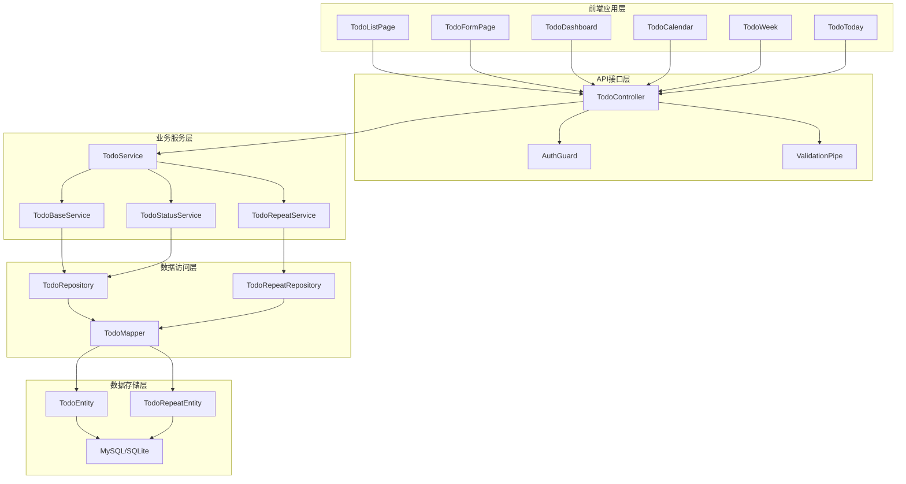
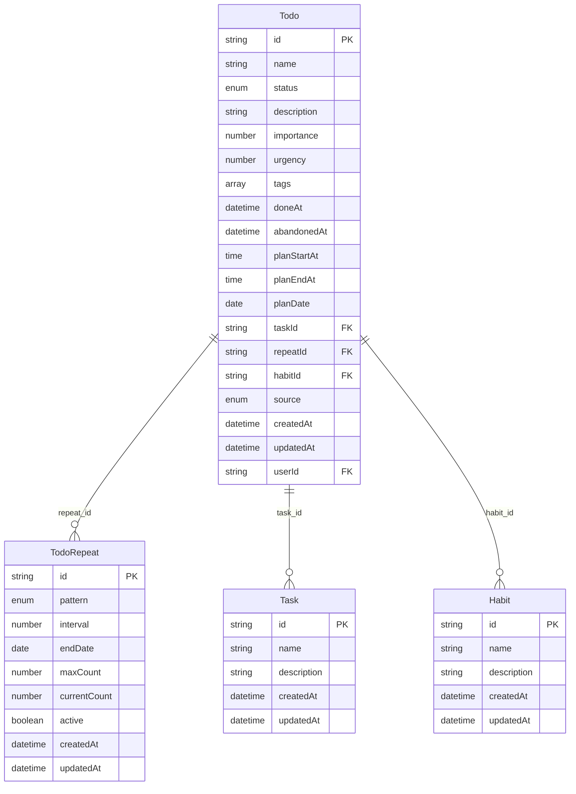

# 待办事项(Todo)管理模块 - 技术开发文档

```yaml
document_meta:
  title: '待办事项管理模块技术开发文档'
  version: 'v1.0.0'
  status: 'draft'
  created_date: '2024-01-01'
  last_updated: '2024-01-01'
  owner: 'Life Toolkit 开发团队'
  reviewers: ['backend_developer', 'frontend_developer']
  target_audience: ['backend_developer', 'frontend_developer', 'ai_assistant']
  related_documents: ['doc/growth/todo/prd.md']

tech_stack:
  backend:
    framework: 'NestJS'
    language: 'TypeScript'
    database: 'MySQL/SQLite'
    orm: 'TypeORM'
    auth: 'JWT + bcrypt'
    validation: 'class-validator'
  frontend:
    framework: 'React 18'
    language: 'TypeScript'
    build_tool: 'Vite'
    ui_library: ['Arco Design', 'Ant Design']
    state_management: 'Redux + Nanostores'
    routing: 'React Router v6'
  shared:
    package_manager: 'pnpm'
    monorepo_tool: 'Turbo'
    code_quality: ['ESLint', 'Prettier', 'Husky']
```

## 一、系统架构设计

### 模块概览

```typescript
interface TodoModuleArchitecture {
  overview: {
    purpose: '提供轻量级待办事项管理功能，支持任务创建、状态管理、重复任务和优先级管理';
    scope: ['待办事项CRUD操作', '状态管理(待办/完成/放弃)', '重复任务自动生成', '优先级和标签管理', '统计分析功能'];
    constraints: ['单用户模式，不支持团队协作', '轻量级设计，不支持复杂项目管理', '基于Life Toolkit架构规范'];
    principles: ['分层架构设计', '模块化组织', '类型安全优先', 'AI友好型代码生成'];
  };

  layers: {
    presentation: {
      components: [
        'TodoListPage - 待办列表页面',
        'TodoFormPage - 待办创建/编辑页面',
        'TodoDashboard - 统计分析页面',
        'TodoCalendar - 日历视图页面',
        'TodoWeek - 周视图页面',
        'TodoToday - 今日待办页面',
      ];
      responsibilities: ['用户交互处理', '数据展示和表单处理', '路由管理', '状态管理'];
      technologies: ['React', 'TypeScript', 'Arco Design', 'React Router'];
    };
    business: {
      modules: [
        'TodoController - 待办事项控制器',
        'TodoService - 核心业务服务',
        'TodoBaseService - 基础CRUD服务',
        'TodoStatusService - 状态管理服务',
        'TodoRepeatService - 重复任务服务',
      ];
      services: ['待办事项创建和编辑', '状态转换管理', '重复任务生成', '优先级计算', '统计分析'];
      patterns: ['Service层模式', 'Repository模式', 'Mapper模式'];
    };
    data: {
      entities: ['TodoEntity - 待办事项实体', 'TodoRepeatEntity - 重复配置实体'];
      repositories: ['TodoRepository - 待办事项数据访问', 'TodoRepeatRepository - 重复配置数据访问'];
      storage: ['MySQL(生产)', 'SQLite(开发)'];
    };
  };

  dependencies: {
    'todo-controller': {
      depends_on: ['todo-service', 'auth-guard', 'validation-pipe'];
      used_by: ['web-app', 'desktop-app'];
      interfaces: ['REST API'];
    };
    'todo-service': {
      depends_on: ['todo-repository', 'todo-mapper', 'user-service'];
      used_by: ['todo-controller'];
      interfaces: ['Service Interface'];
    };
    'todo-entity': {
      depends_on: ['typeorm', 'class-validator'];
      used_by: ['todo-repository', 'todo-mapper'];
      interfaces: ['Entity Interface'];
    };
  };
}
```

### 架构图



## 二、模块设计规范

### 标准文件结构

```typescript
interface TodoModuleStructure {
  module_name: 'todo';
  path: 'apps/server/src/business/growth/todo';

  files: {
    entities: ['entities/todo.entity.ts', 'entities/todo-repeat.entity.ts', 'entities/enum.ts', 'entities/index.ts'];
    dto: ['dto/todo-form.dto.ts', 'dto/todo-filter.dto.ts', 'dto/todo-model.dto.ts', 'dto/index.ts'];
    controllers: ['todo.controller.ts'];
    services: ['todo.service.ts', 'todo-base.service.ts', 'todo-status.service.ts', 'todo-repeat.service.ts'];
    module: ['todo.module.ts'];
  };

  frontend_files: {
    pages: [
      'apps/web/src/pages/growth/todo/index.tsx',
      'apps/web/src/pages/growth/todo/context.tsx',
      'apps/web/src/pages/growth/todo/style.module.less',
    ];
    sub_pages: ['todo-today/', 'todo-all/', 'todo-calendar/', 'todo-week/', 'todo-dashboard/'];
  };

  shared_files: {
    vo: ['packages/vo/src/growth/todo.vo.ts'];
    api: ['packages/api/src/controller/growth/todo.api.ts'];
  };

  interfaces: {
    crud_operations: [
      {
        operation: 'create';
        endpoint: 'POST /api/todo';
        request_dto: 'CreateTodoDto';
        response_vo: 'TodoVo';
        permissions: ['authenticated'];
      },
      {
        operation: 'list';
        endpoint: 'GET /api/todo';
        request_dto: 'TodoFilterDto';
        response_vo: 'TodoVo[]';
        permissions: ['authenticated'];
      },
      {
        operation: 'update';
        endpoint: 'PUT /api/todo/:id';
        request_dto: 'UpdateTodoDto';
        response_vo: 'TodoVo';
        permissions: ['authenticated', 'owner'];
      },
      {
        operation: 'delete';
        endpoint: 'DELETE /api/todo/:id';
        response_vo: 'void';
        permissions: ['authenticated', 'owner'];
      },
    ];
    custom_operations: [
      {
        operation: 'updateStatus';
        endpoint: 'PATCH /api/todo/:id/status';
        request_dto: 'UpdateStatusDto';
        response_vo: 'TodoVo';
        permissions: ['authenticated', 'owner'];
      },
      {
        operation: 'batchUpdateStatus';
        endpoint: 'PATCH /api/todo/batch/status';
        request_dto: 'BatchUpdateStatusDto';
        response_vo: 'TodoVo[]';
        permissions: ['authenticated', 'owner'];
      },
    ];
  };

  dependencies: {
    internal: ['users', 'auth'];
    external: ['@nestjs/common', '@nestjs/typeorm', 'typeorm', 'class-validator'];
    database: ['todo', 'todo_repeat'];
  };
}
```

### 核心业务流程

```typescript
interface TodoBusinessFlow {
  // 创建待办流程
  createTodo: {
    steps: [
      '1. 接收创建请求(CreateTodoDto)',
      '2. 验证用户权限和数据格式',
      '3. 检查重复任务配置',
      '4. 创建待办实体',
      '5. 如果是重复任务，创建重复配置',
      '6. 保存到数据库',
      '7. 返回创建结果(TodoVo)',
    ];
    validation_rules: [
      '标题必填，1-100字符',
      '描述可选，最多500字符',
      '计划日期必填',
      '标签至少一个',
      '重复配置有效性检查',
    ];
  };

  // 状态更新流程
  updateStatus: {
    steps: [
      '1. 接收状态更新请求',
      '2. 验证状态转换有效性',
      '3. 更新待办状态和时间戳',
      '4. 如果是重复任务且状态为完成/放弃',
      '5. 检查重复配置',
      '6. 自动创建下一个重复待办',
      '7. 返回更新结果',
    ];
    state_transitions: {
      todo: ['done', 'abandoned'];
      done: ['todo'];
      abandoned: ['todo'];
    };
  };

  // 重复任务生成流程
  repeatGeneration: {
    steps: [
      '1. 检测重复待办状态变更',
      '2. 获取重复配置',
      '3. 计算下一个重复日期',
      '4. 检查结束条件',
      '5. 创建新的重复待办',
      '6. 保持原始重复配置关联',
      '7. 记录生成日志',
    ];
    repeat_patterns: [
      'daily - 每日重复',
      'weekly - 每周重复',
      'monthly - 每月重复',
      'yearly - 每年重复',
      'custom - 自定义间隔',
    ];
  };
}
```

## 三、数据模型设计

### 实体关系图



### 核心实体定义

#### Todo实体

```typescript
interface TodoEntityStructure {
  table_name: 'todo';
  description: '待办事项核心实体，存储用户的待办任务信息';

  fields: {
    // 基础字段
    id: {
      type: 'string';
      primary_key: true;
      description: '待办事项唯一标识';
    };
    name: {
      type: 'string';
      required: true;
      max_length: 100;
      description: '待办事项名称';
    };
    status: {
      type: 'enum';
      enum: ['todo', 'done', 'abandoned'];
      default: 'todo';
      description: '待办事项状态';
    };
    description: {
      type: 'string';
      required: false;
      max_length: 500;
      description: '待办事项描述';
    };

    // 优先级字段
    importance: {
      type: 'number';
      range: [1, 5];
      default: 3;
      description: '重要程度(1-5)';
    };
    urgency: {
      type: 'number';
      range: [1, 5];
      default: 3;
      description: '紧急程度(1-5)';
    };

    // 标签和分类
    tags: {
      type: 'string[]';
      required: true;
      min_length: 1;
      description: '待办事项标签列表';
    };

    // 时间字段
    planDate: {
      type: 'date';
      required: true;
      description: '计划执行日期';
    };
    planStartAt: {
      type: 'time';
      required: false;
      description: '计划开始时间';
    };
    planEndAt: {
      type: 'time';
      required: false;
      description: '计划结束时间';
    };
    doneAt: {
      type: 'datetime';
      required: false;
      description: '完成时间';
    };
    abandonedAt: {
      type: 'datetime';
      required: false;
      description: '放弃时间';
    };

    // 关联字段
    taskId: {
      type: 'string';
      foreign_key: 'Task.id';
      required: false;
      description: '关联的任务ID';
    };
    repeatId: {
      type: 'string';
      foreign_key: 'TodoRepeat.id';
      required: false;
      description: '重复配置ID';
    };
    habitId: {
      type: 'string';
      foreign_key: 'Habit.id';
      required: false;
      description: '关联的习惯ID';
    };

    // 元数据字段
    source: {
      type: 'enum';
      enum: ['manual', 'repeat', 'habit'];
      default: 'manual';
      description: '待办事项来源';
    };
  };

  indexes: ['idx_todo_user_id', 'idx_todo_status', 'idx_todo_plan_date', 'idx_todo_repeat_id', 'idx_todo_task_id'];

  constraints: [
    'CHECK (importance >= 1 AND importance <= 5)',
    'CHECK (urgency >= 1 AND urgency <= 5)',
    'CHECK (planStartAt < planEndAt OR planStartAt IS NULL OR planEndAt IS NULL)',
  ];
}
```

#### TodoRepeat实体

```typescript
interface TodoRepeatEntityStructure {
  table_name: 'todo_repeat';
  description: '待办事项重复配置实体，继承自通用Repeat组件';
  extends: 'Repeat';

  additional_fields: {
    todos: {
      type: 'Todo[]';
      relation: 'OneToMany';
      description: '关联的待办事项列表';
    };
  };

  inherited_fields: {
    pattern: {
      type: 'enum';
      enum: ['daily', 'weekly', 'monthly', 'yearly', 'custom'];
      description: '重复模式';
    };
    interval: {
      type: 'number';
      default: 1;
      description: '重复间隔';
    };
    endDate: {
      type: 'date';
      required: false;
      description: '重复结束日期';
    };
    maxCount: {
      type: 'number';
      required: false;
      description: '最大重复次数';
    };
    currentCount: {
      type: 'number';
      default: 0;
      description: '当前重复次数';
    };
    active: {
      type: 'boolean';
      default: true;
      description: '是否激活';
    };
  };
}
```

## 四、API接口设计

### RESTful API规范

```typescript
interface TodoAPISpecification {
  base_path: '/api/todo';
  authentication: 'JWT Bearer Token';
  content_type: 'application/json';

  endpoints: {
    // 基础CRUD操作
    create: {
      method: 'POST';
      path: '/create';
      description: '创建新的待办事项';
      request_body: 'CreateTodoVo';
      response: 'TodoVo';
      status_codes: {
        201: '创建成功';
        400: '请求参数错误';
        401: '未授权';
        422: '数据验证失败';
      };
    };

    list: {
      method: 'GET';
      path: '/list';
      description: '获取待办事项列表';
      query_params: 'TodoFilterVo';
      response: 'TodoVo[]';
      status_codes: {
        200: '获取成功';
        401: '未授权';
      };
    };

    page: {
      method: 'GET';
      path: '/page';
      description: '分页获取待办事项';
      query_params: 'TodoPageFilterDto';
      response: 'ResponsePageVo<TodoVo>';
      status_codes: {
        200: '获取成功';
        401: '未授权';
      };
    };

    detail: {
      method: 'GET';
      path: '/detail/:id';
      description: '获取待办事项详情';
      path_params: { id: 'string' };
      response: 'TodoVo';
      status_codes: {
        200: '获取成功';
        401: '未授权';
        404: '待办事项不存在';
      };
    };

    update: {
      method: 'PUT';
      path: '/update/:id';
      description: '更新待办事项';
      path_params: { id: 'string' };
      request_body: 'UpdateTodoVo';
      response: 'TodoVo';
      status_codes: {
        200: '更新成功';
        400: '请求参数错误';
        401: '未授权';
        403: '无权限操作';
        404: '待办事项不存在';
        422: '数据验证失败';
      };
    };

    delete: {
      method: 'DELETE';
      path: '/delete/:id';
      description: '删除待办事项';
      path_params: { id: 'string' };
      response: 'void';
      status_codes: {
        204: '删除成功';
        401: '未授权';
        403: '无权限操作';
        404: '待办事项不存在';
      };
    };

    // 状态管理操作
    done: {
      method: 'PUT';
      path: '/done/:id';
      description: '标记待办事项为完成';
      path_params: { id: 'string' };
      response: '{ result: boolean }';
      business_logic: ['更新状态为done', '记录完成时间', '如果是重复任务，创建下一个重复待办'];
    };

    abandon: {
      method: 'PUT';
      path: '/abandon/:id';
      description: '标记待办事项为放弃';
      path_params: { id: 'string' };
      response: '{ result: boolean }';
      business_logic: ['更新状态为abandoned', '记录放弃时间', '如果是重复任务，创建下一个重复待办'];
    };

    restore: {
      method: 'PUT';
      path: '/restore/:id';
      description: '恢复待办事项为待办状态';
      path_params: { id: 'string' };
      response: '{ result: boolean }';
      business_logic: ['更新状态为todo', '清除完成/放弃时间'];
    };

    doneBatch: {
      method: 'PUT';
      path: '/done/batch';
      description: '批量标记待办事项为完成';
      request_body: 'OperationByIdListVo';
      response: 'void';
      business_logic: ['批量更新状态为done', '记录完成时间', '处理重复任务的自动生成'];
    };
  };

  error_handling: {
    validation_error: {
      code: 422;
      format: {
        message: '数据验证失败';
        errors: 'ValidationError[]';
      };
    };
    business_error: {
      code: 400;
      format: {
        message: '业务逻辑错误';
        error_code: 'string';
      };
    };
    not_found_error: {
      code: 404;
      format: {
        message: '资源不存在';
        resource: 'string';
      };
    };
  };
}
```

## 五、服务层设计

### 服务架构分层

```typescript
interface TodoServiceArchitecture {
  overview: {
    pattern: '分层服务架构';
    principles: ['单一职责原则', '依赖注入', '接口隔离', '业务逻辑封装'];
  };

  layers: {
    controller_layer: {
      responsibility: 'HTTP请求处理、参数验证、响应格式化';
      components: ['TodoController'];
      dependencies: ['TodoService', 'AuthGuard', 'ValidationPipe'];
    };

    service_layer: {
      responsibility: '业务逻辑编排、事务管理';
      components: [
        'TodoService - 主服务，业务流程编排',
        'TodoBaseService - 基础CRUD操作',
        'TodoStatusService - 状态管理逻辑',
        'TodoRepeatService - 重复任务逻辑',
      ];
      dependencies: ['Repository', 'Mapper', 'ExternalServices'];
    };

    repository_layer: {
      responsibility: '数据访问、查询优化';
      components: ['TodoRepository', 'TodoRepeatRepository'];
      dependencies: ['TypeORM', 'Database'];
    };
  };
}
```

### 核心服务实现

#### TodoService - 主业务服务

```typescript
interface TodoServiceImplementation {
  class_name: 'TodoService';
  description: '待办事项主业务服务，负责业务流程编排和事务管理';

  dependencies: ['TodoRepository', 'TodoRepeatService', 'TodoBaseService', 'TodoStatusService'];

  methods: {
    create: {
      signature: 'async create(createTodoDto: CreateTodoDto): Promise<TodoDto>';
      description: '创建待办事项，支持重复任务配置';
      business_logic: [
        '1. 调用TodoBaseService创建基础待办',
        '2. 如果有重复配置，创建重复配置记录',
        '3. 更新待办的repeatId关联',
        '4. 返回完整的待办信息',
      ];
      transaction: true;
      error_handling: [
        '数据验证失败 -> ValidationException',
        '重复配置无效 -> BusinessException',
        '数据库操作失败 -> DatabaseException',
      ];
    };

    update: {
      signature: 'async update(id: string, updateTodoDto: UpdateTodoDto): Promise<TodoDto>';
      description: '更新待办事项，支持重复配置更新';
      business_logic: [
        '1. 调用TodoBaseService更新基础信息',
        '2. 如果有重复配置变更，更新重复配置',
        '3. 返回更新后的待办信息',
      ];
      transaction: true;
    };

    findById: {
      signature: 'async findById(id: string): Promise<TodoDto>';
      description: '根据ID获取待办详情，包含关联的重复配置';
      business_logic: ['1. 调用TodoBaseService查询基础信息', '2. 加载关联的重复配置信息', '3. 返回完整的待办详情'];
      relations: ['repeat'];
    };

    // 状态管理方法委托给TodoStatusService
    done: {
      signature: 'async done(id: string): Promise<void>';
      description: '标记待办为完成状态';
      delegation: 'TodoStatusService.done';
    };

    abandon: {
      signature: 'async abandon(id: string): Promise<void>';
      description: '标记待办为放弃状态';
      delegation: 'TodoStatusService.abandon';
    };

    restore: {
      signature: 'async restore(id: string): Promise<void>';
      description: '恢复待办为待办状态';
      delegation: 'TodoStatusService.restore';
    };

    doneBatch: {
      signature: 'async doneBatch(params: OperationByIdListDto): Promise<void>';
      description: '批量标记待办为完成';
      delegation: 'TodoStatusService.doneBatch';
    };
  };
}
```

## 六、前端架构设计

### 前端模块结构

```typescript
interface TodoFrontendArchitecture {
  overview: {
    framework: 'React 18 + TypeScript';
    architecture: '组件化 + 状态管理';
    routing: 'React Router v6';
    ui_library: 'Arco Design + Ant Design';
  };

  page_structure: {
    base_path: 'apps/web/src/pages/growth/todo';

    main_pages: [
      {
        path: '/todo';
        component: 'TodoPage';
        description: '待办事项主页面，提供路由出口';
        children: [
          '/todo/today - 今日待办页面',
          '/todo/all - 全部待办页面',
          '/todo/calendar - 日历视图页面',
          '/todo/week - 周视图页面',
          '/todo/dashboard - 统计分析页面',
        ];
      },
    ];

    components: [
      'TodoList - 待办列表组件',
      'TodoItem - 待办项组件',
      'TodoForm - 待办表单组件',
      'TodoFilter - 筛选器组件',
      'TodoStats - 统计组件',
      'RepeatConfig - 重复配置组件',
    ];
  };

  state_management: {
    pattern: 'Context + Hooks';
    providers: ['TodoProvider - 待办数据状态管理', 'FilterProvider - 筛选状态管理', 'UIProvider - UI状态管理'];

    hooks: [
      'useTodo - 待办操作hooks',
      'useTodoList - 待办列表hooks',
      'useTodoFilter - 筛选hooks',
      'useTodoStats - 统计hooks',
    ];
  };
}
```

### 页面组件设计

#### TodoPage - 主页面组件

```typescript
interface TodoPageComponent {
  component_name: 'TodoPage';
  file_path: 'apps/web/src/pages/growth/todo/index.tsx';

  responsibilities: ['提供路由出口(Outlet)', '初始化TodoProvider上下文', '管理全局状态和配置'];

  structure: {
    providers: ['TodoProvider'];
    layout: '简单布局，主要作为容器';
    routing: '使用Outlet渲染子路由';
  };

  implementation: `
    export default function TodoPage() {
      return (
        <TodoProvider>
          <Outlet />
        </TodoProvider>
      );
    }
  `;
}
```

#### TodoToday - 今日待办页面

```typescript
interface TodoTodayComponent {
  component_name: 'TodoToday';
  file_path: 'apps/web/src/pages/growth/todo/todo-today/index.tsx';

  responsibilities: ['展示今日待办事项', '支持快速操作(完成/放弃)', '提供创建新待办功能', '实时更新待办状态'];

  features: ['按优先级分组显示', '拖拽排序支持', '批量操作功能', '快捷键支持'];

  state_hooks: ['useTodoList - 获取今日待办列表', 'useTodoOperations - 待办操作方法', 'useFilter - 筛选和排序'];

  ui_components: [
    'TodoList - 待办列表',
    'QuickAddForm - 快速添加表单',
    'PriorityMatrix - 优先级矩阵',
    'BatchActions - 批量操作栏',
  ];
}
```

### 状态管理设计

#### TodoContext - 待办上下文

```typescript
interface TodoContextDesign {
  context_name: 'TodoContext';
  file_path: 'apps/web/src/pages/growth/todo/context.tsx';

  state_structure: {
    todos: 'TodoVo[]';
    loading: 'boolean';
    error: 'string | null';
    filters: 'TodoFilters';
    pagination: 'PaginationState';
    selectedIds: 'string[]';
  };

  actions: {
    // 数据操作
    fetchTodos: '(filters?: TodoFilters) => Promise<void>';
    createTodo: '(todo: CreateTodoVo) => Promise<TodoVo>';
    updateTodo: '(id: string, todo: UpdateTodoVo) => Promise<TodoVo>';
    deleteTodo: '(id: string) => Promise<void>';

    // 状态操作
    markDone: '(id: string) => Promise<void>';
    markAbandoned: '(id: string) => Promise<void>';
    restore: '(id: string) => Promise<void>';
    batchMarkDone: '(ids: string[]) => Promise<void>';

    // UI状态操作
    setFilters: '(filters: Partial<TodoFilters>) => void';
    setSelectedIds: '(ids: string[]) => void';
    clearSelection: '() => void';
  };

  api_integration: {
    service: 'TodoApiService';
    error_handling: '统一错误处理和用户提示';
    loading_states: '细粒度loading状态管理';
    optimistic_updates: '乐观更新提升用户体验';
  };
}
```

### 组件设计规范

#### TodoList - 待办列表组件

```typescript
interface TodoListComponent {
  component_name: 'TodoList';

  props: {
    todos: 'TodoVo[]';
    loading?: 'boolean';
    onItemClick?: '(todo: TodoVo) => void';
    onStatusChange?: '(id: string, status: TodoStatus) => void';
    onEdit?: '(todo: TodoVo) => void';
    onDelete?: '(id: string) => void';
    selectable?: 'boolean';
    selectedIds?: 'string[]';
    onSelectionChange?: '(ids: string[]) => void';
  };

  features: ['虚拟滚动支持大量数据', '拖拽排序', '多选支持', '快捷操作菜单', '优先级视觉指示', '状态动画效果'];

  responsive_design: ['移动端适配', '触摸手势支持', '响应式布局'];
}
```

#### TodoForm - 待办表单组件

```typescript
interface TodoFormComponent {
  component_name: 'TodoForm';

  props: {
    initialValues?: 'Partial<TodoVo>';
    onSubmit: '(values: CreateTodoVo | UpdateTodoVo) => Promise<void>';
    onCancel?: '() => void';
    mode: "'create' | 'edit'";
  };

  form_fields: [
    'name - 待办名称(必填)',
    'description - 描述(可选)',
    'importance - 重要程度(1-5)',
    'urgency - 紧急程度(1-5)',
    'planDate - 计划日期(必填)',
    'planStartAt - 计划开始时间(可选)',
    'planEndAt - 计划结束时间(可选)',
    'tags - 标签列表(必填)',
    'repeat - 重复配置(可选)',
  ];

  validation_rules: [
    '名称长度1-100字符',
    '描述最多500字符',
    '重要程度和紧急程度1-5范围',
    '计划日期不能早于今天',
    '开始时间必须早于结束时间',
    '至少选择一个标签',
  ];

  ui_features: ['实时验证反馈', '智能日期选择', '标签自动补全', '重复配置向导', '表单数据自动保存'];
}
```

## 七、开发规范和最佳实践

### 代码规范

```typescript
interface TodoDevelopmentStandards {
  naming_conventions: {
    files: [
      '组件文件使用PascalCase: TodoList.tsx',
      '工具文件使用camelCase: todoUtils.ts',
      '样式文件使用kebab-case: todo-list.module.less',
    ];

    variables: [
      '变量和函数使用camelCase',
      '常量使用UPPER_SNAKE_CASE',
      '类型和接口使用PascalCase',
      '枚举使用PascalCase',
    ];

    database: ['表名使用snake_case', '字段名使用camelCase(TypeORM自动转换)', '索引名使用idx_前缀'];
  };

  type_safety: {
    principles: ['严格的TypeScript配置', '避免使用any类型', '使用泛型提高代码复用性', '接口优于类型别名'];

    dto_vo_mapping: [
      'DTO用于服务器内部数据传输',
      'VO用于客户端-服务器通信',
      'Entity用于数据库映射',
      '使用Mapper进行对象转换',
    ];
  };

  error_handling: {
    backend: ['使用自定义异常类', '统一错误响应格式', '记录详细错误日志', '区分业务错误和系统错误'];

    frontend: ['全局错误边界', 'API错误统一处理', '用户友好的错误提示', '错误重试机制'];
  };

  testing_strategy: {
    backend: ['单元测试覆盖核心业务逻辑', '集成测试验证API接口', '使用测试数据库', 'Mock外部依赖'];

    frontend: ['组件单元测试', '用户交互测试', 'API集成测试', '端到端测试'];
  };
}
```

### 性能优化策略

```typescript
interface TodoPerformanceOptimization {
  backend_optimization: {
    database: ['合理使用索引优化查询', '分页查询避免大量数据加载', '使用连接查询减少N+1问题', '定期分析慢查询并优化'];

    api: ['响应数据压缩', '合理的缓存策略', '批量操作减少请求次数', '异步处理非关键业务'];

    memory: ['及时释放不用的对象', '使用连接池管理数据库连接', '避免内存泄漏', '监控内存使用情况'];
  };

  frontend_optimization: {
    rendering: [
      '使用React.memo避免不必要的重渲染',
      '虚拟滚动处理大列表',
      '懒加载非关键组件',
      '合理使用useMemo和useCallback',
    ];

    state_management: ['避免过度的状态更新', '使用局部状态而非全局状态', '状态规范化减少冗余', '乐观更新提升用户体验'];

    network: ['API请求去重', '合理的缓存策略', '请求批量化', '离线支持(PWA)'];
  };
}
```

### 部署和运维

```typescript
interface TodoDeploymentGuide {
  development: {
    setup: ['pnpm install 安装依赖', '配置数据库连接', '运行数据库迁移', 'pnpm dev 启动开发服务'];

    database: ['开发环境使用SQLite', '自动运行种子数据', '支持热重载'];
  };

  production: {
    build: ['pnpm build 构建生产版本', '运行生产环境测试', '生成部署包'];

    database: ['生产环境使用MySQL', '运行生产数据库迁移', '配置数据库备份策略'];

    monitoring: ['API响应时间监控', '错误率监控', '数据库性能监控', '用户行为分析'];
  };

  ci_cd: {
    pipeline: ['代码提交触发构建', '运行自动化测试', '代码质量检查', '自动部署到测试环境', '手动部署到生产环境'];

    quality_gates: ['测试覆盖率 > 80%', 'ESLint检查通过', 'TypeScript编译无错误', '安全漏洞扫描通过'];
  };
}
```

## 八、开发任务清单和总结

### 核心开发任务

```yaml
development_roadmap:
  backend_priorities:
    - '完善实体定义和数据库设计'
    - '实现TodoBaseService基础CRUD操作'
    - '实现TodoStatusService状态管理逻辑'
    - '实现TodoRepeatService重复任务逻辑'
    - '完善API接口和错误处理'

  frontend_priorities:
    - '实现TodoContext状态管理'
    - '开发核心组件(TodoList, TodoForm, TodoItem)'
    - '实现今日待办和全部待办页面'
    - '添加筛选、搜索和批量操作功能'
    - '优化用户体验和响应式设计'

  testing_priorities:
    - '单元测试覆盖核心业务逻辑'
    - 'API集成测试'
    - '前端组件测试'
    - '端到端用户流程测试'
```

### 技术债务和风险控制

```yaml
risk_management:
  technical_risks:
    - risk: '重复任务逻辑复杂性'
      mitigation: '充分的单元测试和边界条件验证'
    - risk: '前端状态管理复杂性'
      mitigation: '使用Context模式和不可变数据结构'
    - risk: '数据库性能问题'
      mitigation: '合理索引设计和查询优化'

  quality_assurance:
    - '代码审查流程'
    - '自动化测试覆盖'
    - '性能监控和优化'
    - '用户反馈收集机制'
```

### 项目成功标准

```yaml
success_criteria:
  functionality:
    - '支持PRD中定义的所有核心功能'
    - '重复任务自动生成准确无误'
    - '状态管理逻辑正确可靠'

  performance:
    - 'API响应时间 < 500ms'
    - '页面加载时间 < 2s'
    - '支持1000+待办事项无性能问题'

  user_experience:
    - '操作流畅，界面友好'
    - '错误处理完善，提示清晰'
    - '移动端适配良好'

  code_quality:
    - '测试覆盖率 > 80%'
    - 'TypeScript严格模式无错误'
    - 'ESLint检查通过'
    - '代码结构清晰，易于维护'
```

---

**文档状态**: ✅ 已完善  
**版本**: v1.0.0  
**最后更新**: 2024-01-01  
**维护者**: Life Toolkit 开发团队

本文档基于PRD需求和现有代码结构，提供了Todo模块的完整技术开发指南，涵盖了架构设计、数据模型、API接口、服务层实现、前端组件设计等各个方面，为开发团队提供了详细的技术实现参考。
